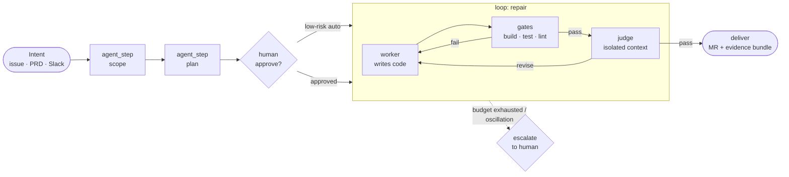

<div align="center">

# ⛵ Coxswain

**The vendor-neutral AI-DLC harness — a control plane for AI-driven development.**

*The coxswain steers the boat, calls the stroke rate, and never rows.*
*The harness steers the work, sets the loop cadence, and never writes the code itself.*

[](LICENSE)
[](ROADMAP.md)
[](CONTRIBUTING.md)

[Quickstart](QUICKSTART.md) · [90-day roadmap](ROADMAP.md) · [vs LangGraph](docs/coxswain-vs-langgraph.md) · [Build plan](coxswain-ai-dlc-harness-plan.md) · [RFCs](https://github.com/marcoakes/coxswain/issues?q=is%3Aissue+RFC)

</div>

---

Coxswain (CLI: `cox`) compiles **intent** — tickets, PRDs, Slack messages — into **verified outcomes**: reviewed merge requests with evidence. It treats *loops* and *graphs of loops* as first-class, portable primitives, and runs the **same workflow definition** on your laptop today and on durable runtimes (Temporal first) tomorrow.

Every cloud's harness locks you to its runtime, its identity system, its gateway. **Nobody owns the neutral layer.** That's the bet — Kubernetes-vs-managed-containers, replayed one layer up.

## What ships first

**One working loop beats seven phases of architecture.** The first release is deliberately small:

```bash
cox run --issue https://github.com/you/repo/issues/42
```

…takes a GitHub issue, runs a **repair loop** in a local sandbox — worker writes code → deterministic gates (build · test · lint) → isolated rubric judge → iterate or exit — and opens a merge request with `evidence.jsonl` and `cost.jsonl` attached. Budgeted, oscillation-proof, auditable.

The worker is **your existing coding agent** — Claude Code, Codex CLI, Gemini CLI — Coxswain never ships its own; it wraps the one you already use in gates, evidence, and budgets. And the first installable artifact is thinner still: **`cox verify`**, standalone gates + evidence bundle around *any* session, usable before the loop even exists. **`v0.1.0` lands September 30, 2026** — see the [90-day roadmap](ROADMAP.md), and the [quickstart](QUICKSTART.md) for the exact developer experience it ships.

## Why

The substrate is converging. Every serious AI-DLC implementation lands on the same five-layer architecture — and the frontier labs are each selling their piece of it. The code layer is commoditizing. What stays defensible is **governance, deterministic verification, audit trails, and execution speed** on top of the substrate.

Coxswain is:

- **Verified, not vibed.** Deterministic gates (build / test / lint / custom linters) always run before any LLM judge. A loop cannot claim "done" without passing its declared verifier.
- **A graph of loops.** A node isn't a function call — it's a *loop-bearing agent* with a contract: budget, verifier, exit conditions. The graph wires those loops into an organization with typed edges and explicit inter-loop feedback paths.
- **Physically worker/judge separated.** The judge sees the rubric, the diff, and the gate outputs — never the worker's chain of reasoning. Engine guarantee, with tests.
- **Auditable as a byproduct.** Every run emits intent → plan → steps → evidence → delivery as queryable JSONL plus OpenTelemetry GenAI traces, with a per-loop cost ledger.
- **Vendor-neutral by construction.** The Graph IR references *capabilities*, never vendor resources. Adapters map capabilities to runtimes; a conformance suite proves each mapping.

Already using LangGraph, CrewAI, or Microsoft Agent Framework? Read the [honest comparison](docs/coxswain-vs-langgraph.md) — they're compile targets and peers here, not competitors.

## A loop is a contract

```yaml
loop:
  kind: repair            # repair | evaluator_optimizer | convergence | explore | evolve
  budgets:
    max_iterations: 6
    max_cost_usd: 4.00
    max_wall_clock: 45m
    max_tokens: 800k
  verify:                  # gates run in order, cheapest first
    - gate: build
    - gate: test
    - gate: lint.custom.architecture-boundaries
    - judge: rubric.acceptance-criteria   # only if gates pass
  exit:
    on_pass: continue
    on_budget_exhausted: escalate.human
    on_oscillation: escalate.human       # same-failure-signature repeated N times
    on_plateau: best_effort_deliver
  evidence: full           # every iteration captured to the run bundle
```

Anti-thrash machinery is core, not optional: failure-signature hashing, score-plateau detection, judge-disagreement tracking, per-loop cost ledgers. The schema is an open spec — [RFC discussion here](https://github.com/marcoakes/coxswain/issues?q=is%3Aissue+RFC).

## A graph is an organization



The worker never sees the judge; the judge never sees the worker's chain of reasoning. Feedback edges are *declared, not implied*, so coupled-loop conflicts (speed loop vs quality loop) are inspectable instead of emergent.

## Architecture (the north star)

The full five-layer architecture — protocol wires (ACP/MCP/A2A), swappable runtime/gateway/identity/memory planes, sandbox layer, self-evolution loop — is specified in the **[build plan](coxswain-ai-dlc-harness-plan.md)**. We are shipping it inside-out: the differentiated core first, the plumbing when the loop has earned it. Execution order is governed by **[ROADMAP.md](ROADMAP.md)**.

```
┌─────────────────────────────────────────────────────────────────┐
│ L1 INTENT        GitHub/GitLab issues · Linear · Jira · Slack   │
├─────────────────────────────────────────────────────────────────┤
│ L2 HARNESS       cox-ir · cox-engine · cox-loops · cox-verify   │
│                  cox-context · cox-policy                       │
├─────────────────────────────────────────────────────────────────┤
│ L3 WIRES         ACP → coding agents · MCP → tools ·            │
│                  A2A → other agents                             │
├─────────────────────────────────────────────────────────────────┤
│ L4 PLANES        runtime · gateway · identity · model · memory  │
│                  (adapters — all swappable, conformance-tested) │
├─────────────────────────────────────────────────────────────────┤
│ L5 SANDBOX       Docker/Podman · VM · gVisor · microVM          │
├─────────────────────────────────────────────────────────────────┤
│ CROSS-CUTTING    OTel GenAI traces · cost ledger · audit JSONL  │
└─────────────────────────────────────────────────────────────────┘
```

## Roadmap

| When | What | Proof |
|---|---|---|
| **Days 1–30** | The "One Loop" MVP: `cox verify` standalone first (gates + evidence around any agent session), then `cox run --issue <url>` → repair loop → MR + evidence bundle. Local only, dry-run mode | demo video |
| **Days 31–60** | Durable execution (SQLite event log, `cox resume`), anti-thrash (oscillation + plateau detection), cost ledger, OTel GenAI traces | crash-and-resume on camera |
| **Days 61–90** | Graph of loops (scope → plan → repair → deliver), one `human` interrupt node, **Coxswain ships a Coxswain PR** | the dogfooded PR, public |

**Q3 2026 OKR:** a GitHub issue becomes a passing MR for Python repos under $2.00 LLM spend. **Q4 2026:** TypeScript targets + the Temporal adapter. Everything else in the plan — gateway plane, policy, context autogen, skills, self-evolution — is deferred behind the working loop, [with reasons](ROADMAP.md#rulings-that-changed-from-the-v10-plan).

## Design principles (the short version)

1. The harness never writes code.
2. Separate the worker from the judge.
3. Deterministic gates are the contract.
4. Vendor-agnostic at every layer — no lock-in, ever.
5. Loops are contracts; graphs are organizations.
6. Audit trail as byproduct.
7. Cost per task is a first-class metric.
8. Build to delete.

The full eleven, with rationale, are in [the plan](coxswain-ai-dlc-harness-plan.md#3-design-principles).

## Contributing

The highest-value contributions right now are **design review and prior art** on the open RFCs — the [loop-contract schema, the gate plugin interface, and the evidence-bundle format](https://github.com/marcoakes/coxswain/issues?q=is%3Aissue+RFC). Once code lands, `make verify` green is the only law. See [CONTRIBUTING.md](CONTRIBUTING.md).

## License

[Apache-2.0](LICENSE). Vendor-neutral, conformance-tested, built to be donated.
